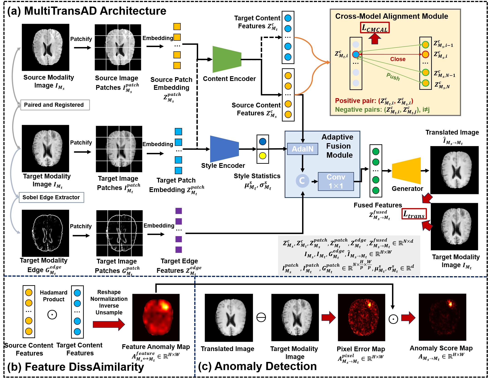

Here is a sample README for my GitHub repository:

# MultiTransAD

This repository contains code for training and testing MultiTransAD on the multi-sequence MR dataset, such as BraTS2021 dataset.


## Code Structure

  * `train.py`: This script is used for training the model.
  * `test.py`: This script is used for testing the trained model.
  * `evaluate.py`: This script is used for evaluating the performance of the model.
  * `model/`: This folder contains the model files.
  * `utils/`: This folder contains utility scripts.
  * `options/`: This folder contains option files.

## Data Preparation and Preprocessing

### Data Download

Download the [BraTS2021 dataset](http://www.braintumorsegmentation.org/) and save it in the `datasets/BraTS2021_TrainingData` folder. The dataset should contain patient folders, and each patient folder should contain paired `t1`, `t2`, `t1ce`, `flair`, and `seg` nii.gz files.

### Data Preprocessing

Use the `preprocessing.py` script in the `utils/` folder to preprocess the BraTS2021 dataset. The preprocessed data will be divided into `train` and `test` folders with a ratio of 4:1, and saved in the `'../data/BraTS2021/train/'` and `'../data/BraTS2021/test/'` paths respectively. The image size will be 200x200, and the saved format will be npy files.

```bash
python utils/preprocessing.py --data_root datasets/BraTS2021_TrainingData --output_root ../data/BraTS2021
```

### Edge Generation

Use the `edge_generate.py` script in the `utils/` folder to generate edge maps for the preprocessed data. Run the following commands to generate edge maps for the `train` and `test` folders:

```bash
python utils/edge_generate.py --input_folder ../data/BraTS2021/train --output_folder ../data/BraTS2021/train_edge
python utils/edge_generate.py --input_folder ../data/BraTS2021/test --output_folder ../data/BraTS2021/test_edge
```

## Training

Modify the parameters in `train.py` as follows:

```python
--data_root ./data/BraTS2021/train
--edge_root ./data/BraTS2021/train_edge
--TASK BraTS2021
```

Then run the following command to start training:

```bash
python train.py
```

The trained model parameters will be saved in the `./weight/BraTS2021/` folder.

## Testing

Run the following command to test the trained model:

```bash
python test.py
```

The output results will be saved in the `'./output/BraTS2021_test'` folder.

## Evaluation

Run the following command to evaluate the performance of the model:

```bash
python evaluate.py --data_dir ./output/BraTS2021_test --task BraTS2021 --save_dir ./results
```

The evaluation results will be saved in the `./results/BraTS2021` folder.

## Dependencies

Make sure to install the required dependencies before running the code. You can use the `requirements.txt` file to install the dependencies:

```bash
pip install -r requirements.txt
```


## Contact

If you have any questions or issues, please contact me after paper publishing.